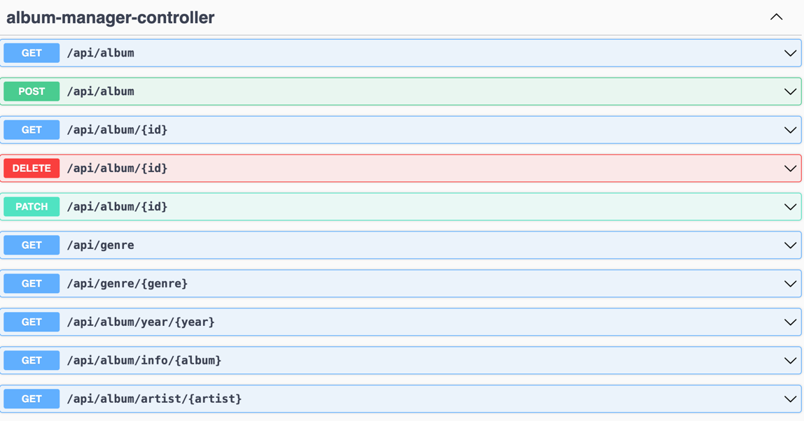

Overview
The Record Shop is a simple backend Spring Boot application. 
It allows Northcoders Record shop to perform CRUD operations.

Few demo queries:
    list all albums in stock
    get album by id
    list all albums by a given artist
    list all albums by a given release year
    list all albums by a given genre
    get album information by album name
    add new albums into the database
    update album details
    delete albums from the database

Defined REST API endpoints
Swagger has been integrated for improved browsing. 
Url at: http://localhost:8080/swagger-ui/index.html#/

Future consideration
    Add more models to simulate complex relationship.
    Integrate Efficient exception to provide feedback for developer or user.